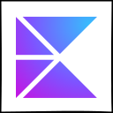

<h4 align="center">RECENT COMMITS</h4>

<!--RECENT_COMMITS_START-->
<a href="https://github.com/olankens/devsetup"><picture><source media="(prefers-color-scheme: dark)" srcset="https://raw.githubusercontent.com/olankens/devsetup/refs/heads/main/.assets/icon-dark.svg"></picture></a><picture></picture><a href="https://github.com/olankens/nightwyn"><picture><source media="(prefers-color-scheme: dark)" srcset="https://raw.githubusercontent.com/olankens/nightwyn/refs/heads/main/.assets/icon-dark.svg"></picture></a><picture></picture><a href="https://github.com/olankens/padforge"><picture><source media="(prefers-color-scheme: dark)" srcset="https://raw.githubusercontent.com/olankens/padforge/refs/heads/main/.assets/icon-dark.svg"></picture></a><picture></picture><a href="https://github.com/olankens/codewall"><picture><source media="(prefers-color-scheme: dark)" srcset="https://raw.githubusercontent.com/olankens/codewall/refs/heads/main/.assets/icon-dark.svg"></picture></a><picture></picture><a href="https://github.com/olankens/petwards"><picture><source media="(prefers-color-scheme: dark)" srcset="https://raw.githubusercontent.com/olankens/petwards/refs/heads/main/.assets/icon-dark.svg"></picture></a><picture></picture><a href="https://github.com/olankens/githubaw"><picture><source media="(prefers-color-scheme: dark)" srcset="https://raw.githubusercontent.com/olankens/githubaw/refs/heads/main/.assets/icon-dark.svg"></picture></a>
<!--RECENT_COMMITS_CEASE-->

<!-- <h4 align="center">FAVOURITE STACK</h4>

<a href="https://jetbrains.com/idea"><picture><source media="(prefers-color-scheme: dark)" srcset=".assets/intellij-idea-dark.svg"></picture></a><picture><a href="https://angular.dev"><picture><source media="(prefers-color-scheme: dark)" srcset=".assets/angular-dark.svg"></picture></a><picture><a href="https://jetbrains.com/kotlin-multiplatform"><picture><source media="(prefers-color-scheme: dark)" srcset=".assets/kotlin-multiplatform-dark.svg"></picture></a><picture><a href="https://spring.io"><picture><source media="(prefers-color-scheme: dark)" srcset=".assets/spring-dark.svg"></picture></a><picture><a href="https://postgresql.org"><picture><source media="(prefers-color-scheme: dark)" srcset=".assets/postgresql-dark.svg"></picture></a><picture><a href="https://coolify.io"><picture><source media="(prefers-color-scheme: dark)" srcset=".assets/coolify-dark.svg"></picture></a><picture>

 -->