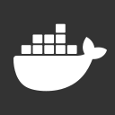

#### MY FEATURED WORKS

<!--LATEST_REPOS_START-->

<picture></picture><picture></picture><picture></picture><picture></picture><picture></picture>

<!--LATEST_REPOS_END-->

#### MY FAVOURITE STACK

<picture></picture><picture></picture><picture></picture><picture></picture><picture></picture>

