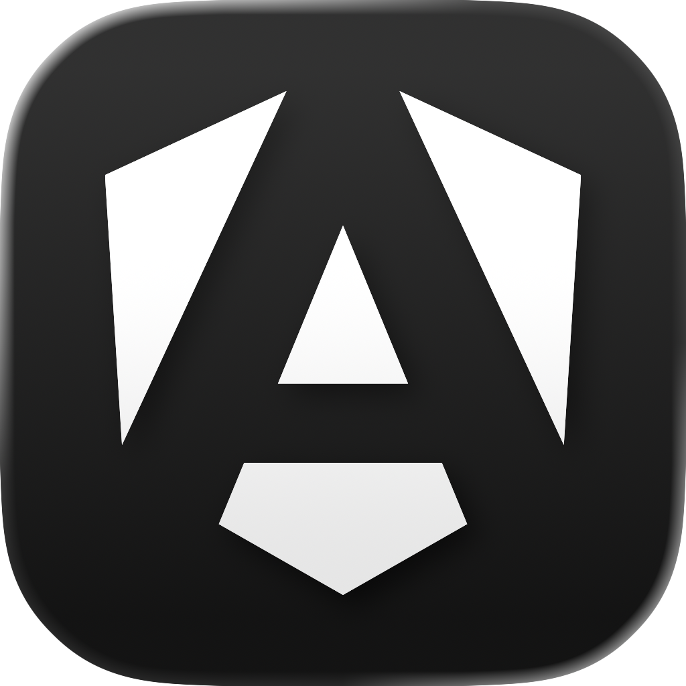

<h4>TYPESCRIPT ARTISAN</h4>

Lorem ipsum dolor sit amet, consectetur adipiscing elit. Nullam nisi dui, auctor id venenatis vel, interdum sit amet lacus. In dapibus quis ante eu auctor. Ut feugiat congue libero, consequat gravida magna convallis vitae. Nam tempus leo suscipit justo luctus vulputate.

<h4>MY LATEST CREATION</h4>

<h4>MY FAVOURITE STACK</h4>

